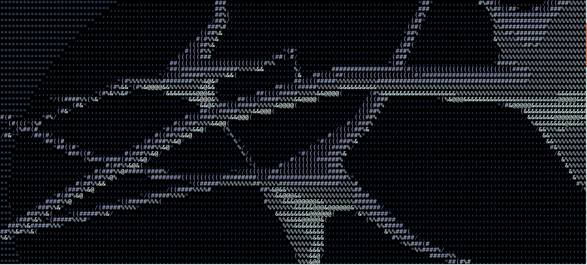

<h1 align="center">
   
</h1>
<h4 align="center">The minimal c deep learning api you are looking for</h4>

[]()
[]()
[](https://github.com/geisten/gstnn/issues)
[](https://github.com/geisten/gstnn/pulls)
[](/LICENSE)

---
gstnn is a neural net processing engine written in **C**. It allows you to create your own neural net. _gstnn_ is not
meant for newbies and non-programmers. The library is designed for “scalability, speed and ease-of-use” as well as
optimized for Unix/POSIX (*BSD, Linux, MacOSX) like environments.

> What I cannot create, I do not understand
> 
> -- <cite>Richard Feynman</cite>

## Getting Started

The easiness of this application can be demonstrated very well by the famous MNIST data set for learning handwritten
numbers. First, you need to create a source directory and download the source from github:

```shell
git clone https://github.com/geisten/gstnn
```

Change to the directory `cd gstnn/data` and download the mnist training and testing data

```shell
sh mnist_data_download.sh
```

Change to the parent directory `cd ..` and run `make mnist` to set up the mnist config file. Run make to build the
project.

```shell
make config_mnist
make
```

Run the mnist neural net program. Ignore the output while training the neural net.

```shell
.\gstnn -t ./data/mnist_targets_train.f32 ./data/mnist_images_train.f32 1>/dev/null
```

Finally, test the outcome of the training via the MNIST test data set. Use the `-f` flag to freeze the learning process.

```shell
.\gstnn -f -t ./data/mnist_targets_test.f32 ./data/mnist_images_test.f32 1>/dev/null 2>&1
```

The program will take a while to train the handwritten numbers.

## Differences to existing frameworks

gstnn is a minimalistic neural network written in C.

In contrast to Keras, Tensorflow, etc. gstnn is much smaller and simpler.

- strongly reduced functionality compared to the aforementioned alternatives
- gstnn has no Lua integration, no shell-based configuration and comes without any additional tools.
- gstnn is only a single binary, and the source code of the reference implementation is intended to never exceed 1000
  SLOC.
- gstnn is customized through editing its source code, which makes it extremely fast and secure - it does not process
  any input data which isn't known at compile time. You don't have to activate Lua/Python or some weird configuration
  file format, beside C, to customize it for your needs: you only have to activate C (at least in order to edit the
  header file).
- Because gstnn is customized through editing its source code, it's pointless to make binary packages of it.

## Configuration

Configuration is done with config.h. It can be edited just like any other C source code file. It contains definitions of
variables that are going to be used by gstnn.c and therefore it is vital that the file is always up to date. Read the
comments in the generated config.h to edit it according to your needs.

An example of a simple neural net is the [MNIST demo configuration](config_mnist.h).

See [kern doc](doc/kern.md) for the technical documentation of the available functions.  

## Support

The first step is to look at the sourcecode and the config.h for obvious names, which could be related to the problem
that arose.

## Development

gstnn is actively developed. You can browse its [source code](https://github.com/geisten/gstnn.git) repository or get a
copy using git with the following command:

```shell
git clone https://github.com/geisten/gstnn.git
```

See the [Architectural Decision Records](doc/adr.md) for the general design decisions taken.
    


